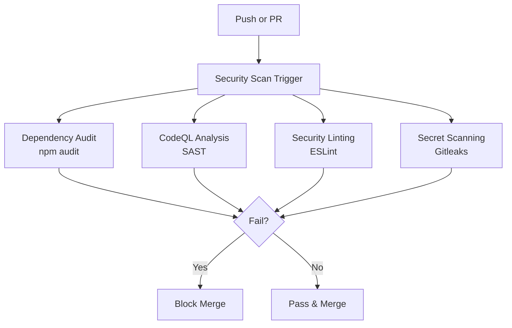

# Automated Security Scanning Guide

## Overview

The Muse DApp implements comprehensive automated security scanning using GitHub Actions CI/CD. This ensures every code change is vetted for security vulnerabilities before merging.

## Security Scanning Components

### 1. Dependency Vulnerability Audit

**Tool**: `npm audit`
**Frequency**: On every push and PR
**Severity Level**: High and above
**Run Time**: ~1-2 minutes

Scans all npm dependencies across all workspaces (backend, frontend, contracts) for known vulnerabilities published to the npm registry.

```yaml
# Found in: .github/workflows/security-scan.yml
- name: Run npm audit on backend
  run: npm audit --audit-level=high
```

**Local Equivalent**:
```bash
npm run audit
```

**What it catches**:
- Known CVEs in dependencies
- Outdated packages with security issues
- Transitive dependency vulnerabilities

**Handling findings**:
1. Update vulnerable dependencies using `npm audit fix`
2. If auto-fix fails, manually update to patched version
3. Review changelogs for breaking changes
4. Re-run audit to confirm resolution

---

### 2. CodeQL Static Analysis

**Tool**: GitHub CodeQL
**Frequency**: On every push and PR, plus scheduled weekly
**Languages**: JavaScript/TypeScript
**Run Time**: ~5-7 minutes

Advanced static analysis that understands code semantics, not just patterns. Detects:

- SQL/NoSQL injection
- XSS vulnerabilities
- Path traversal
- Command injection
- SSRF
- Timing attacks
- Insecure cryptography
- And 100+ other vulnerability classes

**Configuration**: `.codeql/codeql-config.yml`

**Local Equivalent**:
- Install CodeQL CLI: `brew install codeql` (macOS) or download from GitHub
- Run: `codeql database create --language=javascript-typescript`
- `codeql query run --query=security-and-quality`

**Viewing Results**:
1. Go to GitHub repository → Security tab
2. Click "Code scanning alerts"
3. Filter by "CodeQL" category
4. Review severity, location, and suggested fix

**Suppressing False Positives**:
If a finding is a false positive, use CodeQL's suppression mechanism:

```javascript
/* codeql[detection-id] */
```

Consult the alert details for the exact suppression comment.

---

### 3. Security Linting with ESLint

**Tool**: ESLint with `eslint-plugin-security` and `eslint-plugin-node-security`
**Frequency**: On every push and PR
**Run Time**: ~30 seconds

Enforces secure coding patterns and detects common security anti-patterns:

**Rules enabled**:
- `security/detect-object-injection` - Prevents prototype pollution
- `security/detect-possible-timing-attacks` - Detects non-constant time comparisons
- `node-security/detect-eval-with-expression` - Blocks `eval()` and similar
- `node-security/detect-non-literal-fs-filename` - Prevents path traversal in file operations
- `node-security/detect-non-literal-require` - Prevents dynamic module loading
- `node-security/detect-unsafe-regex` - Detects ReDoS vulnerabilities

**Configuration**: `.eslintrc.js` (root-level config shared across workspaces)

**Local Equivalent**:
```bash
npm run lint:security
```

**Adding a rule**:
Edit `.eslintrc.js` and add to `rules` object:

```javascript
rules: {
  'security/detect-XXX': 'error'  // or 'warn'
}
```

---

### 4. Secret Scanning with Gitleaks

**Tool**: Gitleaks
**Frequency**: On every push and PR
**Run Time**: ~10 seconds

Detects hardcoded secrets before they're committed:

**Config**: `.gitleaks.toml`

**Customizable rules for**:
- JWT secrets
- API keys (OpenAI, Stability AI, AWS, etc.)
- Database connection strings
- Generic high-entropy strings

**Local Equivalent**:
```bash
# Install gitleaks locally
brew install gitleaks   # macOS
# or download from https://github.com/gitleaks/gitleaks

# Run scan
gitleaks detect --source=. --verbose
```

**False positives**:
Whitelist patterns in `.gitleaks.toml` under `[allowlists]`.

**If you accidentally commit a secret**:
1. **Immediately** rotate/revoke the compromised credential
2. Force-remove from history:
   ```bash
   git rm --cached <file-with-secret>
   git filter-branch --force --index-filter \
     "git rm --cached --ignore-unmatch <file>" \
     --prune-empty --tag-name-filter cat -- --all
   git push origin --force --all
   ```
3. The secret will be caught by Gitleaks before merge

---

### 5. Security Headers Validation

**Tool**: Custom integration test
**Frequency**: On every push (backend only)

Validates that the Express.js backend enforces required security headers:

**Required Headers**:
- `X-Frame-Options: DENY`
- `X-Content-Type-Options: nosniff`
- `X-XSS-Protection: 1; mode=block`
- `Referrer-Policy: strict-origin-when-cross-origin`
- `Content-Security-Policy` (environment-dependent)

**Test Location**: `apps/backend/src/tests/securityHeaders.test.ts`

**Local Run**:
```bash
cd apps/backend
npm test -- src/tests/securityHeaders.test.ts
```

---

## Workflow Overview



---

## Workflow Files

| File | Purpose |
|------|---------|
| `.github/workflows/security-scan.yml` | Main security pipeline (all jobs) |
| `.github/workflows/codeql-analysis.yml` | Dedicated CodeQL pipeline |
| `.eslintrc.js` | Root ESLint config with security rules |
| `.gitleaks.toml` | Secret detection rules |
| `.codeql/codeql-config.yml` | CodeQL configuration |

---

## CI/CD Status Badge

Add this to your README.md to show security scanning status:

```markdown

```

---

## Troubleshooting CI Failures

### "npm audit" fails with vulnerabilities

```bash
# Fix automatically if possible:
npm run audit:fix

# If manual fix needed:
npm update <package-name>

# Re-run security scan locally before pushing:
npm run security:scan
```

### CodeQL finds a critical issue

1. Review the alert in GitHub Security tab
2. Examine the code paths highlighted
3. Fix the vulnerability (see CodeQL's suggested remediation)
4. Commit and push – CodeQL will re-analyze automatically

### ESLint security lint fails

```bash
# Check which rule failed
cd apps/backend
npm run lint:security -- --debug

# Auto-fix if possible
npm run lint:fix

# Or suppress intentionally if it's a false positive
// eslint-disable-next-line security/detect-object-injection
```

### Gitleaks blocks push (false positive)

If legitimate code triggers Gitleaks (e.g., test fixtures with fake secrets):

1. Add the file to allowlist in `.gitleaks.toml`:
   ```toml
   [[allowlists]]
   paths = ["tests/fixtures/secrets.test.js"]
   ```

2. Commit the updated `.gitleaks.toml`

**Never** allow real secrets in the codebase – always use environment variables.

---

## Security Scanning Schedule

- **Push events**: Immediate scan (all jobs)
- **Pull request events**: Immediate scan (all jobs)
- **Scheduled**: Weekly full scan (Mondays 00:00 UTC)

---

## Monitoring & Alerts

GitHub will automatically:

1. Mark failing checks on PRs (blocks merge if required)
2. Send email notifications to repository admins on new security alerts
3. Populate the **Security** tab with CodeQL findings
4. Generate Dependabot alerts (separate from this pipeline)

To receive notifications:
- Go to **Settings** → **Notifications**
- Enable "Security" alerts
- Add team members as security managers

---

## Continuous Improvement

This security scanning setup will be periodically reviewed:

- Add new ESLint security rules as needed
- Update CodeQL queries when GitHub releases new packs
- Expand Gitleaks rules for new types of secrets
- Integrate with Snyk or other commercial scanners if needed

**Contributing**: To suggest improvements, open a PR updating:
- `.gitleaks.toml` (new secret patterns)
- `.eslintrc.js` (new rules)
- `.github/workflows/` (new scan types)
- This documentation

---

## Resources

- [GitHub CodeQL Documentation](https://docs.github.com/en/code-security/code-scanning/automatically-scanning-your-code-for-vulnerabilities-and-errors/about-code-scanning)
- [ESLint Security Plugin](https://github.com/nodesecurity/eslint-plugin-security)
- [Node Security ESLint Plugin](https://github.com/azat-io/eslint-plugin-node-security)
- [Gitleaks Documentation](https://github.com/gitleaks/gitleaks)
- [OWASP Top 10](https://owasp.org/www-project-top-ten/)

---

**Questions?** Contact the security team or open an issue (non-security).
